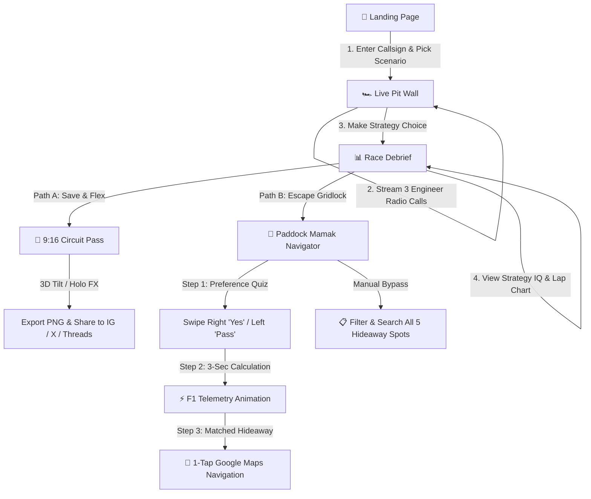

# JomLap 🏁
> **Sepang Thermal Pit Wall & Circuit Companion**  
> *Call the strategy, survive the tropical monsoon, and escape the 90,000-spectator gridlock.*  
> Built for the KrackedDevs **Formula 1's Return to Sepang** Hackathon.

---

## [Executive Summary]

**JomLap** is an interactive, mobile-first Formula 1 strategy simulation and post-race companion tailored specifically for the return of the Malaysian Grand Prix at **Sepang International Circuit**. 

Combining live sovereign Malaysian AI models (**ILMU by YTL AI Labs**), deterministic thermal-asphalt physics simulation, and real-time **Google Places & Google Maps navigation**, JomLap puts the user in the seat of Chief Race Strategist. As track temperatures spike to 50°C+ and monsoon rain threatens Turn 11, players navigate high-stakes debates between three distinct engineer personas, make the race-winning pit call, generate verifiable 9:16 social media story passes, and effortlessly escape post-race highway congestion with an interactive supper navigator.

---

## [The Problem]

1. **Sepang's Unique Microclimate Chaos**: Sepang is legendary in motorsport for its 50°C+ asphalt temperatures and sudden 4:00 PM equatorial monsoons. In real racing, light rain touching 52°C asphalt boils off instantly, while heavy monsoons flood sector 3 in under 90 seconds. Existing generic F1 games fail to capture this distinct Malaysian thermodynamic battle between tire compounds and tropical asphalt.
2. **Generic, Impersonal AI Strategy Games**: Most AI strategy demos output flat, uninspired text without distinct character motives, localized dialect (Manglish), or realistic team-radio pressure.
3. **The 90,000-Spectator Post-Race Gridlock**: Anyone who has attended the Malaysian GP knows that once the chequered flag drops, 90,000 spectators funnel into the same two highway bottlenecks (ELITE & KLIA Expressway), creating 3-hour traffic jams with no easy way to find open food spots or alternate routes.

---

## [The Solution]

JomLap delivers a cohesive, end-to-end race day experience through four core pillars:

1. **Multi-Persona Live Radio Comms**:
   * 🤖 **AERO-9** *(Brackley AI Strategy Model · Ice Tone)*: Driven by raw probability and data deltas. Always pushes to **Box for Inters**.
   * 👴 **Uncle Sepang** *(22-Year Trackside Marshal · Yellow Tone)*: Reads the sky over Turn 11 and heat shimmer off the asphalt in authentic Manglish (*"Can one la, don't play play"*). Pushes to **Stay Out on Hards**.
   * 🏍️ **Din Turbo** *(Junior Rempit Engineer · Red Tone)*: 22-year-old unsupervised junior engineer with chaotic send-it energy. Always gambles on the **Full Wet Send**.
2. **Thermal Lap Simulation & Strategy IQ Scoring**:
   * Deterministic lap-by-lap tire compound crossover simulation factoring in evaporation rates, water accumulation, safety car deltas, and driver gaps.
   * Rates players on a transparent 0–100 **Strategy IQ** metric.
3. **High-Fidelity 9:16 "Circuit Pass" Story Card**:
   * Exportable 9:16 Instagram/TikTok/WhatsApp story pass rendered on-device at 960×1707 resolution.
   * Interactive pointer-driven 3D physics tilt with optional GPU-accelerated **Holographic Color-Dodge Shader FX**.
4. **Paddock Mamak & Supper Navigator**:
   * Rule-based interactive preference quiz (swipe right/left on eating moods).
   * 3-second F1 telemetry calculation animation with live GPS location tracking.
   * Live Google Places API integration delivering real star ratings, open hours, and direct Google Maps turn-by-turn navigation.

---

## [Tech Stack]

| Layer | Technology | Purpose |
|---|---|---|
| **Frontend Framework** | **Next.js 16 (App Router)** | Modern React server & client components with streaming support |
| **Language** | **TypeScript** | Strict type safety across simulation, API routes, and state |
| **Styling & Design** | **Tailwind CSS v4 + Vanilla CSS** | Custom F1 broadcast graphics, glassmorphism, GPU-accelerated keyframes |
| **AI / LLM Engine** | **ILMU (YTL AI Labs)** | Sovereign Malaysian LLM for authentic Manglish voice synthesis |
| **LLM Orchestration** | **Vercel AI SDK (`ai`)** | Non-blocking token streaming for live team radio transmissions |
| **Maps & Places** | **Google Maps & Places API (New)** | Real-time 24h restaurant ratings, review counts, and turn-by-turn routes |
| **Image Generation** | **`html-to-image`** | 3x high-DPI canvas rasterization for social story passes |
| **Audio Synthesis** | **Web Audio API** | Procedural team radio squawks, static bursts, and transmission beeps |

---

## [Project Structure]

```text
f1-sepang/
├── app/
│   ├── api/
│   │   ├── places/route.ts       # Google Places API proxy for live supper spots
│   │   └── radio/route.ts        # ILMU / OpenRouter streaming LLM radio endpoint
│   ├── globals.css               # Design tokens, broadcast typography & animations
│   ├── layout.tsx                # Root HTML layout, viewport & metadata
│   └── page.tsx                  # Single-route orchestrator (5 distinct views)
├── components/
│   ├── Chrome.tsx                # Wordmarks, Navigation Header, Avatar & Title Primitives
│   ├── Debrief.tsx               # Post-race debrief, Strategy IQ score & winner verdict
│   ├── Landing.tsx               # Hero banner, live comms badge, scenario picker & roster
│   ├── LapChart.tsx              # SVG lap delta timeline & crossover curve visualizer
│   ├── Mamak.tsx                 # Swipe vibe quiz, 3s telemetry animation & Google Places directory
│   ├── Menu.tsx                  # Slide-out navigation drawer with live crew status
│   ├── PitWall.tsx               # Live streaming radio transmissions & strategy decision cards
│   ├── SharePass.tsx             # 3D interactive tilt pass with holographic shader & rasterizer
│   └── ShareRow.tsx              # Instant share triggers for X, Threads & Native Share Sheet
├── lib/
│   ├── ai.ts                     # ILMU & OpenRouter AI provider setup
│   ├── beep.ts                   # Web Audio API procedural radio beeps & squawks
│   ├── fallback.ts               # Zero-latency offline fallback radio scripts
│   ├── mamak.ts                  # Sepang bypass corridors, hideaway spots & engineer tips
│   ├── personas.ts               # Engineer persona definitions, roles, avatars & prompts
│   ├── radio.ts                  # Client-side ReadableStream radio reader
│   ├── scenarios.ts              # Sepang thermodynamic weather & track scenarios
│   ├── share.ts                  # Social share captions & intent URL builders
│   ├── sim.ts                    # Deterministic lap physics & Strategy IQ scoring engine
│   ├── useTilt.ts                # Pointer-driven 3D card tilt hook
│   └── views.ts                  # View state types
├── public/
│   └── portraits/                # Illustrated halftone portraits (Aero-9, Uncle, Din)
├── AGENTS.md                     # Development guidelines & rules
├── package.json                  # Project dependencies & build scripts
└── tsconfig.json                 # TypeScript compiler configuration
```

---

## [User Flows]



### 1. **The Briefing & Pre-Race Setup** (`Landing.tsx`)
* Driver enters their custom **Callsign** (e.g. `VIPER`, `HAMILTON`, `STRATEGIST`).
* Inspects the **Pit Wall Roster** with character portraits and strategy biases.
* Selects from 3 realistic Sepang scenarios (*Turn 11 Cell*, *Ghost Rain*, or *The 4PM Deluge*).

### 2. **The Live Pit Wall** (`PitWall.tsx`)
* User enters the live pit wall with real-time circuit telemetry (Track temp, air temp, humidity).
* Radio squawk fires and all 3 engineers broadcast their live arguments via streaming audio/text.
* Strategist makes the call: **Box for Inters** (Aero-9), **Stay Out on Hards** (Uncle Sepang), or **Full Wet Gambit** (Din Turbo).

### 3. **The Race Debrief** (`Debrief.tsx`)
* Physics engine simulates lap times, tire degradation, and track crossover points.
* Delivers the **Strategy IQ Score (0–100)** and letter grade.
* The winning engineer delivers the final radio verdict gloating or coping with the result.

### 4. **The Circuit Pass** (`SharePass.tsx`)
* Drivers receive their official Paddock VIP story pass with custom callsign and Strategy IQ.
* Interactive 3D tilt with real-time glare tracking and optional **Holo Shader FX**.
* One-click download as a high-res PNG or direct sharing to **Instagram Stories**, **X**, and **Threads**.

### 5. **Paddock Mamak & Supper Navigator** (`Mamak.tsx`)
* **Intuitive Vibe Questionnaire**: Users swipe on 5 simple eating preference questions.
* **3-Second Telemetry Animation**: Ticking HUD calculates GPS coordinates, highway bottlenecks, and detour availability.
* **Matched Hideaway**: Displays the ideal spot with engineer advice, live Google Place ratings, open hours, and direct turn-by-turn Google Maps navigation.
* **Manual Search**: Users can bypass the quiz anytime to browse, search, and filter all nearby hideaways.

---

## 🛠️ Getting Started

### 1. Clone & Install Dependencies
```bash
git clone https://github.com/mewHacks/f1-sepang.git
cd f1-sepang
npm install
```

### 2. Configure Environment Variables
Create a `.env.local` file in the project root:
```env
# Sovereign Malaysian LLM (Primary)
ILMU_API_KEY=sk-...
ILMU_MODEL=nemo-super

# OpenRouter (Optional Fallback)
OPENROUTER_API_KEY=sk-or-...

# Google Maps Platform (For live Google Places supper spots)
GOOGLE_MAPS_API_KEY=AIzaSy...
```

### 3. Run Development Server
```bash
npm run dev
```
Open [http://localhost:3000](http://localhost:3000) in your browser.

---

## 🏁 License
MIT © 2026 JomLap Team. Built for the KrackedDevs Hackathon.
